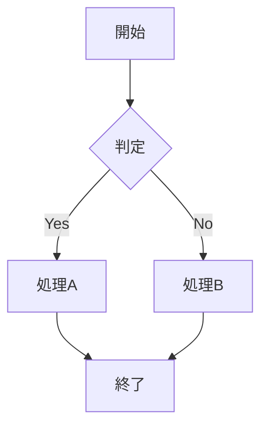

# Project Overview

## Features

これは機能一覧です

| Feature | Status | Priority |
|---------|--------|----------|
| User Authentication | Completed | High |
| Dashboard | In Progress | High |
| Reports | Planned | Medium |

## Tasks

これはタスク一覧です

| Task | Assignee | Notes |
|------|----------|-------|
| Design UI | Alice | - Create wireframes - Review with team - Finalize design |
| Backend API | Bob | 1. Setup database 2. Create endpoints 3. Write tests |
| Documentation | Charlie | Working on user guide |

こんな感じで、Mermaidのグラフも書けます。

# Testing Plan

これはテストプランです

| Test Case | Expected Result | Status |
|-----------|----------------|--------|
| Login Test | User can login successfully | Pass |
| Logout Test | User can logout successfully | Pass |
| Invalid Login | Show error message | Pass |

下にもテキストを書けます

# Bug Tracking

## High Priority

| Bug ID | Description | Assigned To |
|--------|-------------|-------------|
| BUG-001 | Login fails on mobile | Alice |
| BUG-002 | Dashboard not loading | Bob |

## Low Priority

| Bug ID | Description | Assigned To |
|--------|-------------|-------------|
| BUG-003 | Minor UI alignment issue | Charlie |
